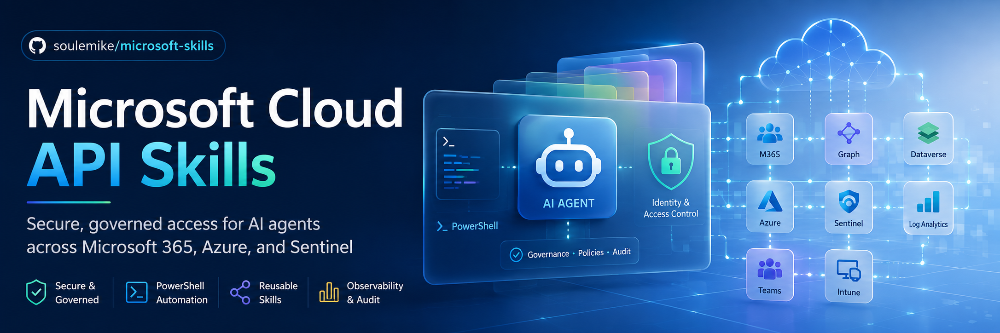

# Microsoft Cloud API Skills

[](https://docs.microsoft.com/powershell/)
[](LICENSE)
[](https://scorecard.dev/viewer/?uri=github.com/soulemike/microsoft-skills)



> **Give your agents secure, governed access to Microsoft 365, Azure, and Sentinel.**
>
> One auth layer. One secret policy. Zero embedded credentials.

---

## For Agents

This repository is designed to be used by AI coding agents. Point your agent here and it can:

- Query Sentinel incidents, Intune devices, and Teams channels
- Run KQL against Log Analytics workspaces
- Deploy Copilot Studio agents via Dataverse
- Execute VM run commands and manage SSH keys

**Agent entry points:**
- [`AGENTS.md`](AGENTS.md) — Machine-readable contract: tools, auth patterns, security boundaries
- [`llms.txt`](llms.txt) — Concise discovery context for LLMs
- [`mcp/`](mcp/) — MCP server for Claude Code, Codex, Cursor, and other MCP-compatible agents

```powershell
# Agent quickstart: list Sentinel incidents from the last 24 hours
$ctx = ./prerequisites/Setup-AuthenticationContext.ps1 -Resource "https://management.azure.com/"
./skills/sentinel/Get-SentinelIncident.ps1 -AuthContext $ctx -WorkspaceName "my-workspace"
```

---

## What This Is

This project provides reusable, composable PowerShell skills for interacting with Microsoft Graph, Azure Resource Manager, Dataverse, Microsoft Sentinel, Microsoft Teams, Intune, and VM Guest Management. It prioritizes **security-first authentication** and **consistent patterns** across all service domains.

**Core principle:** No secret material is embedded in any skill. All authentication follows a strict preference hierarchy with runtime enforcement.

---

## Quickstart

### 1. Prerequisites

```powershell
# Install required modules (Az, Microsoft.Graph, etc.)
./prerequisites/Install-RequiredModules.ps1

# Verify your environment is ready
./prerequisites/Test-Prerequisites.ps1

# Run smoke tests (no live auth required)
./prerequisites/Test-Smoke.ps1

# Run token validation tests (catches audience mismatches, expiry issues)
./prerequisites/Test-TokenValidation.ps1

# Load environment variables from .env file (optional)
Import-Module ./skills/Common.psm1
Load-DotEnv -Path "./.env"

# Auto-detect and configure the best available authentication method
$authContext = ./prerequisites/Setup-AuthenticationContext.ps1 -Resource "https://management.azure.com/"
```

### 2. Connect to a Service

```powershell
# Microsoft Graph — managed identity
$graph = ./skills/graph/Connect-GraphApi.ps1 -AuthenticationType ManagedIdentity -Environment AzureCloud

# Azure ARM — certificate
$azure = ./skills/azure/Connect-AzureApi.ps1 `
    -AuthenticationType Certificate `
    -TenantId $env:TENANT_ID `
    -ClientId $env:CLIENT_ID `
    -CertificatePath "/secure/certs/automation.pfx" `
    -Environment AzureCloud

# Dataverse — federated credentials (e.g., from GitHub Actions OIDC)
$dataverse = ./skills/dataverse/Connect-DataverseApi.ps1 `
    -AuthenticationType Federated `
    -TenantId $env:TENANT_ID `
    -ClientId $env:CLIENT_ID `
    -FederatedToken $env:AZURE_FEDERATED_TOKEN `
    -EnvironmentUrl "https://contoso.crm.dynamics.com"

# Log Analytics — managed identity
$logAnalyticsCtx = ./skills/loganalytics/Connect-LogAnalyticsApi.ps1 `
    -AuthenticationType ManagedIdentity `
    -Environment AzureCloud
```

### 3. Invoke Requests

```powershell
# Graph — list users with pagination
./skills/graph/Invoke-GraphRequest.ps1 -Context $graph -Uri "/users?`$select=id,displayName,mail"

# Azure — list resource groups
./skills/azure/Invoke-AzureRestMethod.ps1 -Context $azure -Uri "/subscriptions/$($env:SUBSCRIPTION_ID)/resourcegroups?api-version=2021-04-01"

# Log Analytics — run a KQL query
./skills/loganalytics/Invoke-LogAnalyticsKqlQuery.ps1 `
    -AuthContext $logAnalyticsCtx `
    -WorkspaceId "00000000-0000-0000-0000-000000000000" `
    -Query "SecurityAlert | take 10"
```

---

## Authentication Hierarchy

All skills enforce this preference order. The setup script auto-detects the highest-trust method available.

| Rank | Method | When to Use |
|------|--------|-------------|
| 1 | **Managed Identity** | Azure-hosted workloads (VM, Function App, App Service, Arc) |
| 2 | **Federated Credentials (OIDC)** | GitHub Actions, Azure DevOps, GitLab CI/CD |
| 3 | **Certificate-Based Auth** | Hybrid, on-prem, or sovereign cloud where MI/OIDC unavailable |
| 4 | **Client Secret** | **Last resort only** — emits a mandatory runtime warning |

Interactive authentication (device code flow, browser login) is **not permitted** for skill execution.

---

## Standardized Context Object

All `Connect-*` scripts return a **plain hashtable** with a consistent shape:

```powershell
@{
    Token              = "eyJ0eXAiOiJKV1Qi..."      # Bearer token for the target service
    ExpiresOn          = [datetime]"2026-01-01T12:00:00Z"  # Token expiry (UTC)
    TenantId           = "00000000-0000-0000-0000-000000000000"  # Entra tenant GUID
    ClientId           = "00000000-0000-0000-0000-000000000000"  # Application ID
    Environment        = "AzureCloud"                     # AzureCloud, AzureUSGovernment, AzureChinaCloud
    BaseUri            = "https://graph.microsoft.com/v1.0"      # Service endpoint
    AuthenticationType = "ManagedIdentity"                # The method used to acquire the token
}
```

**Service-specific additions:**
- **Azure ARM**: `SubscriptionId`, `ArmEndpoint`
- **Dataverse**: `EnvironmentUrl`
- **Power Platform**: `BapEndpoint`

This consistency lets you pass contexts between skills and write generic helper logic.

---

## Unified Entry Point

There is no single "connect to everything" script. Each Microsoft cloud service has a different token audience, so authentication is **per-service by design**:

```powershell
# Connect to each service you need
$graphCtx    = ./skills/graph/Connect-GraphApi.ps1 -AuthenticationType ManagedIdentity -Environment AzureCloud
$azureCtx    = ./skills/azure/Connect-AzureApi.ps1 -AuthenticationType ManagedIdentity -Environment AzureCloud
$dataverseCtx = ./skills/dataverse/Connect-DataverseApi.ps1 -AuthenticationType ManagedIdentity -EnvironmentUrl "https://contoso.crm.dynamics.com"

# Use each context with its service
./skills/graph/Invoke-GraphRequest.ps1 -AuthContext $graphCtx -Uri "/users"
./skills/azure/Invoke-AzureRestMethod.ps1 -AuthContext $azureCtx -Uri "/subscriptions/..."
./skills/dataverse/Invoke-DataverseRequest.ps1 -AuthContext $dataverseCtx -Uri "/accounts"
```

For multi-tenant scenarios, use `-Profile` or `-Prefix` on any `Connect-*` script:

```powershell
$prod = ./skills/graph/Connect-GraphApi.ps1 -Profile "prod" -ConfigPath "./config.yaml"
$gov  = ./skills/graph/Connect-GraphApi.ps1 -Prefix "GOV" -Environment AzureUSGovernment
```

---

## Project Structure

```
.
├── skills/
│   ├── Common.psm1                       # Shared auth, REST, pagination, endpoint resolution
│   ├── graph/
│   │   ├── SKILL.md                      # Graph-specific patterns and examples
│   │   └── ...                           # Connect-GraphApi.ps1, Invoke-GraphRequest.ps1, auth/
│   ├── azure/
│   │   ├── SKILL.md                      # ARM-specific patterns and examples
│   │   └── ...                           # Connect-AzureApi.ps1, Invoke-AzureRestMethod.ps1, auth/
│   ├── dataverse/
│   │   ├── SKILL.md                      # OData, GDS, and file operation patterns
│   │   └── ...                           # Connect-DataverseApi.ps1, Invoke-DataverseRequest.ps1, auth/
│   ├── sentinel/
│   │   ├── SKILL.md                      # Data vs mgmt plane, KQL patterns
│   │   └── ...                           # Invoke-SentinelArmRequest.ps1, Get-SentinelIncident.ps1, ...
│   ├── loganalytics/
│   │   ├── SKILL.md                      # Workspace lifecycle, KQL, DCE/DCR, ingestion fallback
│   │   └── ...                           # Connect-LogAnalyticsApi.ps1, Invoke-LogAnalyticsKqlQuery.ps1, New-LogAnalyticsWorkspace.ps1, Send-LogAnalyticsData.ps1, auth/
│   ├── teams/
│   │   ├── SKILL.md                      # Teams Graph v1.0 patterns
│   │   └── ...                           # Get-TeamsChannel.ps1, Get-TeamsMember.ps1, ...
│   ├── intune/
│   │   ├── SKILL.md                      # v1.0 vs beta, list-vs-get caveats
│   │   └── ...                           # Get-IntuneDevice.ps1, Get-IntuneConfigurationPolicy.ps1, ...
│   ├── vm-guest-management/
│   │   ├── SKILL.md                      # Run Command, Bastion, SSH patterns
│   │   └── ...                           # Invoke-VmRunCommand.ps1, Connect-VmBastionSsh.ps1, ...
│   ├── powerplatform/
│   │   ├── SKILL.md                      # BAP API and ARM token patterns
│   │   ├── Connect-PowerPlatformApi.ps1
│   │   └── Get-PowerPlatformEnvironment.ps1
│   ├── copilotstudio/
│   │   ├── SKILL.md                      # Dataverse bot entity and knowledge source patterns
│   │   ├── Deploy-CopilotAgent.ps1
│   │   ├── Get-CopilotAgentInfo.ps1
│   │   └── Manage-CopilotKnowledge.ps1
│   └── sharepoint-online/
│       └── SKILL.md                      # SharePoint Online gap documentation
├── prerequisites/
│   ├── Setup-AuthenticationContext.ps1   # Auto-detect auth method with fallback chain
│   ├── Install-RequiredModules.ps1       # Install Az, Microsoft.Graph, etc.
│   └── Test-Prerequisites.ps1            # Verify environment readiness
├── docs/
│   ├── auth-patterns.md                  # Auth method selection guide
│   ├── environment-endpoints.md          # Commercial / Gov / China endpoint mapping
│   ├── secret-management.md              # Secret handling policy
│   ├── token-chaining.md                 # Cross-service token reuse patterns
│   ├── patterns-and-caveats.md           # Per-service lessons learned
│   ├── multi-tenant-auth.md              # Multi-context session management
│   ├── project-positioning.md            # Ecosystem positioning
│   ├── competitive-landscape.md          # Alternative solutions analysis
│   └── future-considerations.md          # Optional integration opportunities
├── mcp/                                  # MCP server for agent integration
│   └── README.md                         # MCP server setup guide
├── .env.example                          # Environment variable template
├── config.yaml                           # Example multi-tenant configuration
├── llms.txt                              # Concise agent discovery context
├── AGENTS.md                             # Machine-readable agent contract
└── agents.md                             # Master design specification
```

---

## Documentation

### Per-Skill Documentation

Each service domain has its own `SKILL.md` with domain-specific patterns, toolchain guidance, caveats, and examples:

| Service | Skill Doc |
|---------|-----------|
| Microsoft Graph | [`skills/graph/SKILL.md`](skills/graph/SKILL.md) |
| Azure Resource Manager | [`skills/azure/SKILL.md`](skills/azure/SKILL.md) |
| Dataverse | [`skills/dataverse/SKILL.md`](skills/dataverse/SKILL.md) |
| Power Platform / BAP | [`skills/powerplatform/SKILL.md`](skills/powerplatform/SKILL.md) |
| Copilot Studio | [`skills/copilotstudio/SKILL.md`](skills/copilotstudio/SKILL.md) |
| Microsoft Sentinel | [`skills/sentinel/SKILL.md`](skills/sentinel/SKILL.md) |
| Log Analytics | [`skills/loganalytics/SKILL.md`](skills/loganalytics/SKILL.md) |
| Microsoft Teams | [`skills/teams/SKILL.md`](skills/teams/SKILL.md) |
| Intune / Endpoint Manager | [`skills/intune/SKILL.md`](skills/intune/SKILL.md) |
| VM Guest Management | [`skills/vm-guest-management/SKILL.md`](skills/vm-guest-management/SKILL.md) |
| SharePoint Online | [`skills/sharepoint-online/SKILL.md`](skills/sharepoint-online/SKILL.md) |

### Cross-Cutting Documentation

| Document | Purpose |
|----------|---------|
| [`AGENTS.md`](AGENTS.md) | Machine-readable agent contract: tools, auth patterns, security boundaries |
| [`llms.txt`](llms.txt) | Concise agent discovery context |
| [`agents.md`](agents.md) | Master index: scope, auth hierarchy, file tree |
| [`docs/auth-patterns.md`](docs/auth-patterns.md) | Decision matrix and scenario-based auth guidance |
| [`docs/secret-management.md`](docs/secret-management.md) | Secret hierarchy, handling rules, and hard prohibitions |
| [`docs/environment-endpoints.md`](docs/environment-endpoints.md) | Cross-cloud endpoint mapping (Commercial, US Gov, China) |
| [`docs/token-chaining.md`](docs/token-chaining.md) | Reusing Azure context for Graph, Dataverse, and other audiences |
| [`docs/multi-tenant-auth.md`](docs/multi-tenant-auth.md) | Multi-context session isolation with config files and prefixed env vars |
| [`docs/patterns-and-caveats.md`](docs/patterns-and-caveats.md) | Operational lessons: Intune list-vs-get, VM Run Command traps, Graph pagination |
| [`docs/project-positioning.md`](docs/project-positioning.md) | Where this project sits in the Microsoft cloud automation ecosystem |
| [`docs/competitive-landscape.md`](docs/competitive-landscape.md) | Comparison with official modules, community tools, and cross-platform alternatives |
| [`docs/future-considerations.md`](docs/future-considerations.md) | Potential bridges to MCP servers, skill marketplaces, and upstream contributions |
| [`docs/lsp-recommendations.md`](docs/lsp-recommendations.md) | Language Server Protocol guidance for contributors |

---

## Implemented Skills

| Service Domain | Skill Doc | Files | Key Capabilities |
|----------------|-----------|-------|------------------|
| **Graph** | [SKILL.md](skills/graph/SKILL.md) | `Connect-GraphApi.ps1`, `Invoke-GraphRequest.ps1`, 4 auth wrappers | App-only auth, pagination, throttling, retry |
| **Azure ARM** | [SKILL.md](skills/azure/SKILL.md) | `Connect-AzureApi.ps1`, `Invoke-AzureRestMethod.ps1`, 3 auth wrappers | REST wrapper with async operation handling |
| **Dataverse** | [SKILL.md](skills/dataverse/SKILL.md) | `Connect-DataverseApi.ps1`, `Invoke-DataverseRequest.ps1`, `Get-DataverseEnvironment.ps1`, 4 auth wrappers | OData queries, GDS environment discovery |
| **Sentinel** | [SKILL.md](skills/sentinel/SKILL.md) | `Invoke-SentinelArmRequest.ps1`, `Get-SentinelIncident.ps1`, `Get-SentinelAlertRule.ps1` | ARM management plane (incidents, alert rules, watchlists) |
| **Log Analytics** | [SKILL.md](skills/loganalytics/SKILL.md) | `Connect-LogAnalyticsApi.ps1`, `Invoke-LogAnalyticsKqlQuery.ps1`, `New-LogAnalyticsWorkspace.ps1`, `New-LogAnalyticsCustomTable.ps1`, `New-LogAnalyticsIngestionPipeline.ps1`, `Send-LogAnalyticsData.ps1`, 4 auth wrappers | KQL queries, workspace lifecycle, DCE/DCR provisioning, DCR-first ingestion with Data Collector fallback |
| **Teams** | [SKILL.md](skills/teams/SKILL.md) | `Get-TeamsChannel.ps1`, `Get-TeamsMember.ps1`, `Invoke-TeamsGraphRequest.ps1` | Graph v1.0 Teams endpoints |
| **Intune** | [SKILL.md](skills/intune/SKILL.md) | `Get-IntuneDevice.ps1`, `Get-IntuneConfigurationPolicy.ps1`, `Invoke-IntuneGraphRequest.ps1` | v1.0 + beta endpoint support, list-vs-get handling |
| **VM Guest Management** | [SKILL.md](skills/vm-guest-management/SKILL.md) | `Invoke-VmRunCommand.ps1`, `Connect-VmBastionSsh.ps1`, `Invoke-VmSshKeyRotation.ps1` | Run Command (action + managed), Bastion SSH, SSH key lifecycle |
| **Power Platform / BAP** | [SKILL.md](skills/powerplatform/SKILL.md) | `Connect-PowerPlatformApi.ps1`, `Get-PowerPlatformEnvironment.ps1` | BAP API auth with ARM-scoped token, admin environment listing with pagination |
| **Copilot Studio** | [SKILL.md](skills/copilotstudio/SKILL.md) | `Deploy-CopilotAgent.ps1`, `Get-CopilotAgentInfo.ps1`, `Manage-CopilotKnowledge.ps1` | Agent publish/unpublish/update via Dataverse, knowledge source CRUD with customizable entity sets |

---

## Documented Gaps

These service domains are scoped but not yet implemented:

| Service | Status | Skill Doc | Notes |
|---------|--------|-----------|-------|
| **SharePoint Online** | Gap | [SKILL.md](skills/sharepoint-online/SKILL.md) | Requires PnP PowerShell for data plane; Graph has partial coverage |
| **Microsoft Purview** | Gap | — | Documented as future requirement |
| **Microsoft Defender** | Gap | — | Documented as future requirement |
| **Microsoft Fabric / Power BI** | Gap | — | Documented as future requirement |
| **Azure DevOps** | Gap | — | Documented as future requirement |
| **Exchange Online** | Gap | — | Documented as future requirement |

---

## Multi-Tenant Support

Use prefixed environment variables or a centralized config file to manage multiple tenants:

```powershell
# Prefixed env vars
$prod = ./skills/graph/Connect-GraphApi.ps1 -Prefix "PROD" -Environment AzureCloud
$gov  = ./skills/graph/Connect-GraphApi.ps1 -Prefix "GOV" -Environment AzureUSGovernment

# Config file
$prod = ./skills/graph/Connect-GraphApi.ps1 -Profile "prod" -ConfigPath "./config.yaml"
```

See [`docs/multi-tenant-auth.md`](docs/multi-tenant-auth.md) and [`config.yaml`](config.yaml) for details.

---

## Requirements

- **PowerShell 7.2+** (`#Requires -Version 7.2`)
- **Azure modules**: `Az.Accounts`, `Az.Resources` (installed by `Install-RequiredModules.ps1`)
- **Microsoft Graph modules**: `Microsoft.Graph.Authentication` (optional; skills can use raw REST)
- **Optional**: `MSAL.PS` for certificate-based token acquisition

---

## Contributing

When adding a new skill:

1. Follow the normalized auth parameter set defined in [`AGENTS.md`](AGENTS.md).
2. Use `Common.psm1` for auth context resolution, REST execution, and pagination.
3. Emit the mandatory warning if client secret auth is used.
4. Document any service-specific caveats in `docs/patterns-and-caveats.md`.
5. Update the status table in [`AGENTS.md`](AGENTS.md) and the file list in this README.
