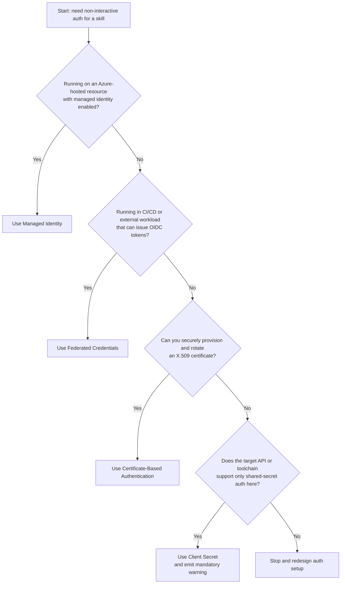

# Authentication Patterns

> **Purpose:** Turn the authentication guidance in `agents.md` into an operator-facing decision guide for choosing the safest supported auth method.
>
> **Core rule:** Interactive login is not permitted for skill execution. Skills must use dedicated identities and follow the documented trust hierarchy.

---

## 1. Default Decision Rule

Always choose the highest-trust method the runtime can support:

1. **Managed Identity**
2. **Federated Credentials (OIDC / workload identity)**
3. **Certificate-Based Authentication**
4. **Client Secret** as a last resort only

If you reach client secret authentication, the skill should emit the mandatory runtime warning documented in `agents.md`.

---

## 2. Flowchart-Style Guidance

---

## 3. Decision Matrix

| Condition | Preferred Method | Why | Typical Fallback |
|-----------|------------------|-----|------------------|
| Azure-hosted workload with MI enabled | **Managed Identity** | No secret material to store, rotate, or expose | Federated if workload leaves Azure; certificate if MI is unavailable |
| External CI/CD or trusted workload identity provider | **Federated Credentials** | Short-lived tokens and no secret storage in pipelines | Certificate |
| Hybrid / on-prem / regulated environment without MI or OIDC | **Certificate** | Higher trust than shared secrets and operationally rotatable | Client secret only if certificate support is impossible |
| Legacy ecosystem or API/tooling gap | **Client Secret** | Only when the service cannot support higher-trust methods | None; redesign later to move up the hierarchy |

---

## 4. Scenario-Based Recommendations

| Scenario | Recommended Method | Why this is the default | Notes |
|----------|--------------------|-------------------------|-------|
| **Azure VM / VM Scale Set** | **Managed Identity** | IMDS-based token acquisition is the cleanest unattended pattern | Probe `169.254.169.254` with `Metadata=true`; role assignments must exist first |
| **Azure Function App / App Service / Automation** | **Managed Identity** | Platform injects local identity endpoint and header | Detect `IDENTITY_ENDPOINT` and `IDENTITY_HEADER` |
| **GitHub Actions** | **Federated Credentials** | Native OIDC support avoids storing secrets in GitHub | Requires `ACTIONS_ID_TOKEN_REQUEST_URL` and `ACTIONS_ID_TOKEN_REQUEST_TOKEN` |
| **Azure DevOps Pipelines** | **Federated Credentials** | OIDC token exchange removes long-lived secrets from service connections | Detect `SYSTEM_OIDCREQUESTURI` and `SYSTEM_ACCESSTOKEN` |
| **Local development** | **Certificate** | Best non-interactive local pattern when managed identity and federation are absent | Client secret is allowed only as a last resort and should remain temporary |

---

## 5. Method-by-Method Guidance

### Managed Identity

Use when the code runs on:

- Azure VMs / VMSS
- App Service / Functions
- Container workloads with managed identity support
- Azure Arc-enabled servers

**Why it wins:** the identity is hosted by Azure, so the skill never needs to load a secret, certificate password, or private key from local configuration.

**Operational prerequisite:** identity assignment alone is not enough. The resource also needs the correct RBAC or application permissions for the target service.

### Federated Credentials

Use when the workload runs outside a managed-identity host but can present a trusted OIDC assertion.

Common examples:

- GitHub Actions
- Azure DevOps
- GitLab CI/CD
- Other external workload identity providers

**Why it wins:** the pipeline holds only short-lived exchange material instead of a reusable secret.

### Certificate-Based Authentication

Use when neither managed identity nor federation is available and you still need unattended, non-secret auth.

**Best fit:** sovereign cloud, on-prem automation, hybrid hosts, or environments where certificate governance is already mature.

**Storage rule:** the skill may accept only a certificate path or thumbprint. The private key must stay in Key Vault, certificate store, or another controlled location and must never be committed to source control.

### Client Secret

Use only when the API or surrounding tooling cannot support any higher-trust option.

**Mandatory warning text:**

> Client credential authentication is in use. This method relies on a shared secret and is less secure than managed identity, federated credentials, or certificate-based authentication. Migrate to a higher-trust method if the target service supports it.

**What this means operationally:** tighter rotation, tighter access control, and explicit migration planning.

---

## 6. Normalized Connection Parameters

`agents.md` defines a normalized auth contract for `Connect-*` functions so callers do not have to relearn each service domain. Treat this as the standard interface for the toolkit as service-specific skills are filled out; some current scripts may still expose only a subset today.

| Parameter | Meaning |
|-----------|---------|
| `-AuthenticationType` | `ManagedIdentity`, `Federated`, `Certificate`, or `ClientCredentials` |
| `-TenantId` | Tenant context for non-MI flows |
| `-ClientId` | App registration / workload identity application ID |
| `-ClientSecret` | `SecureString` only; never plain text |
| `-CertificateThumbprint` / `-CertificatePath` | Certificate selector; never use both together |
| `-CertificatePassword` | Optional password for encrypted PFX files |
| `-FederatedToken` | OIDC token provided by the executing platform |
| `-UseManagedIdentity` | Alias for `-AuthenticationType ManagedIdentity` |
| `-Environment` / `-AzureEnvironment` | `AzureCloud`, `AzureUSGovernment`, or `AzureChinaCloud` |

---

## 7. Practical Selection Rules

- If the workload runs in Azure and MI works, stop there.
- If the workload runs in CI/CD and can exchange OIDC, do not add a secret just because it is familiar.
- If you need an offline, unattended identity outside Azure, prefer a certificate over a client secret.
- If you are forced to use a client secret, treat that as technical debt and document the migration target.

Related docs:

- `docs/secret-management.md`
- `docs/environment-endpoints.md`
- `docs/multi-tenant-auth.md`
